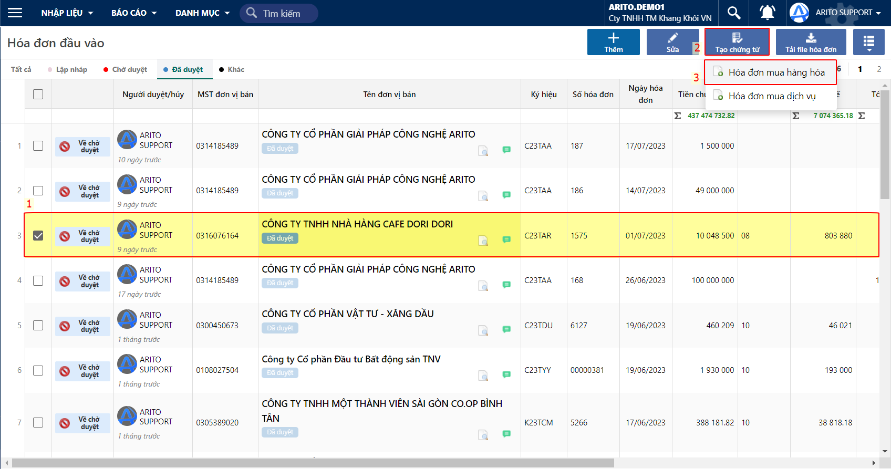
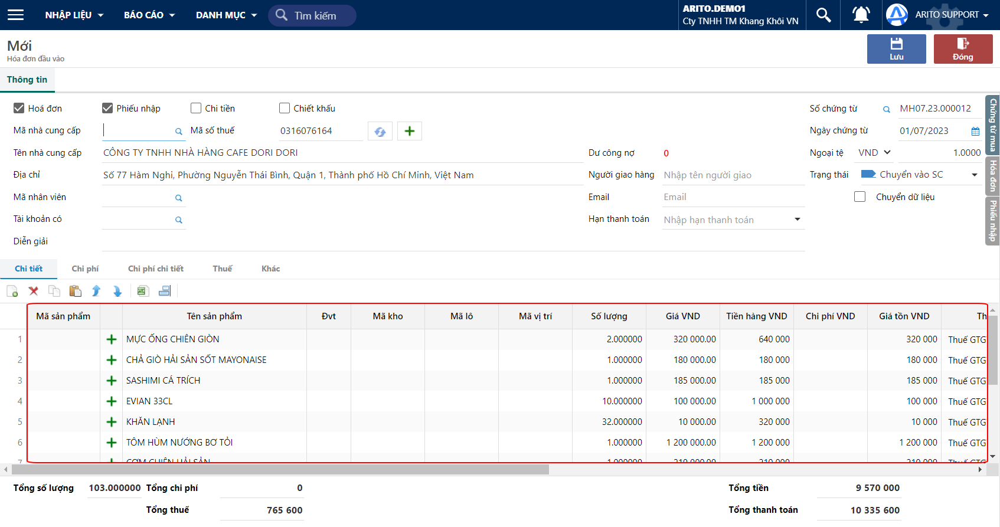
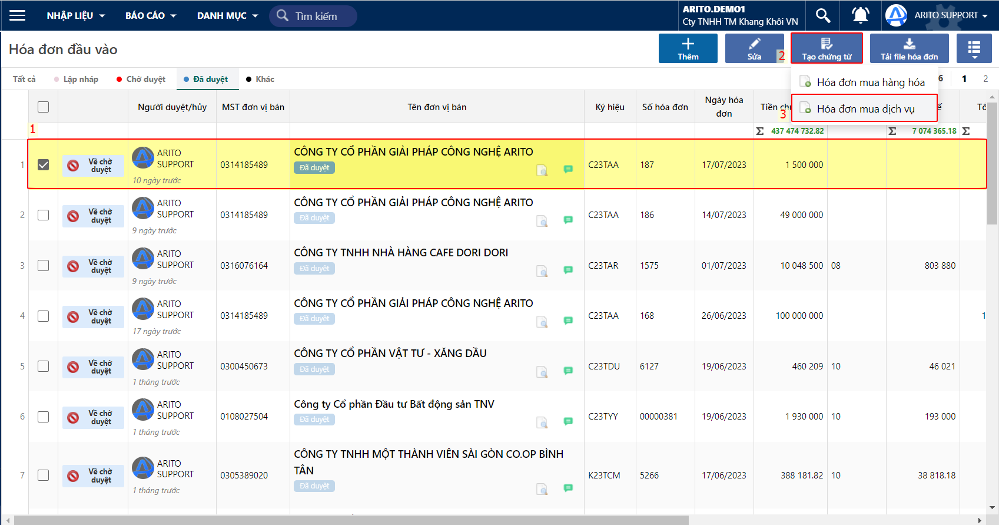
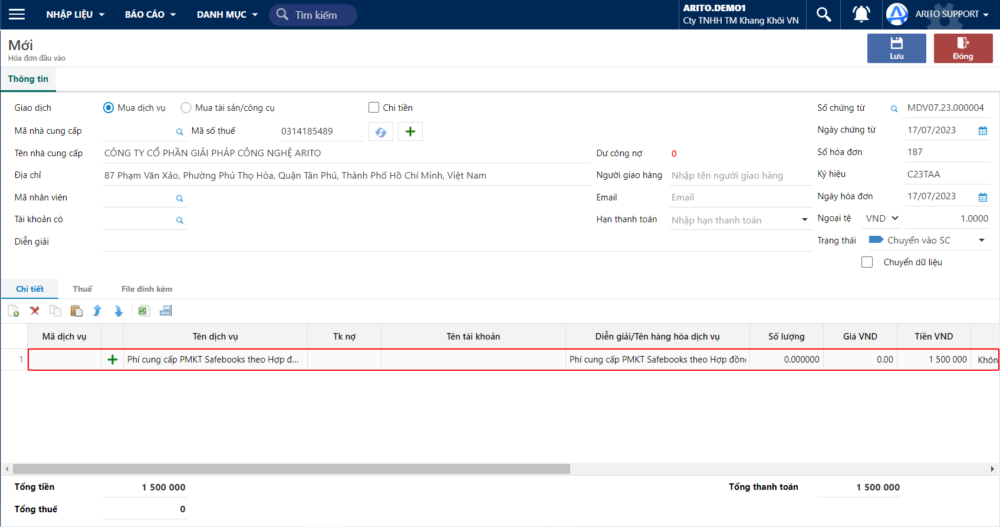

# \[DONE]Cách tạo chứng từ kế toán từ Hoá đơn đầu vào

## Mục đích

Tạo chứng từ kế toán (hoá đơn mua hàng trong nước, hoá đơn mua dịch vụ) để hạch toán và ghi sổ; phục vụ cho việc kê khai và lập bảng kê hoá đơn mua vào.

Các mục đích chính của việc tạo chứng từ kế toán từ hoá đơn đầu vào bao gồm:

* Kê khai hoá đơn đầu vào
* Hạch toán kế toán các hoá đơn hợp lệ
* Quản lý chi phí

## Hướng dẫn các thao tác

#### Trường hợp 1: Tạo hoá đơn mua hàng hoá

**Bước 1:** Chọn phiếu và tạo chứng từ Hoá đơn mua hàng hoá

<figure><figcaption>
Tạo hoá đơn mua hàng mua hàng
</figcaption></figure>

**Bước 2**: Tại màn hình Hoá đơn mua hàng hoá, kiểm tra các thông tin được tạo tự động và thêm các thông tin cần theo dõi

<figure><figcaption>
Hoá đơn mua hàng hoá
</figcaption></figure>

#### Trường hợp 2: Tạo hoá đơn mua dịch vụ

**Bước 1:** Chọn phiếu và tạo chứng từ Hoá đơn mua dịch vụ

<figure><figcaption>
Tạo hoá đơn mua dịch vụ
</figcaption></figure>

**Bước 2:** Tại màn hình Hoá đơn mua dịch vụ, kiểm tra các thông tin được tạo tự động và thêm các thông tin cần theo dõi

<figure><figcaption></figcaption></figure>
