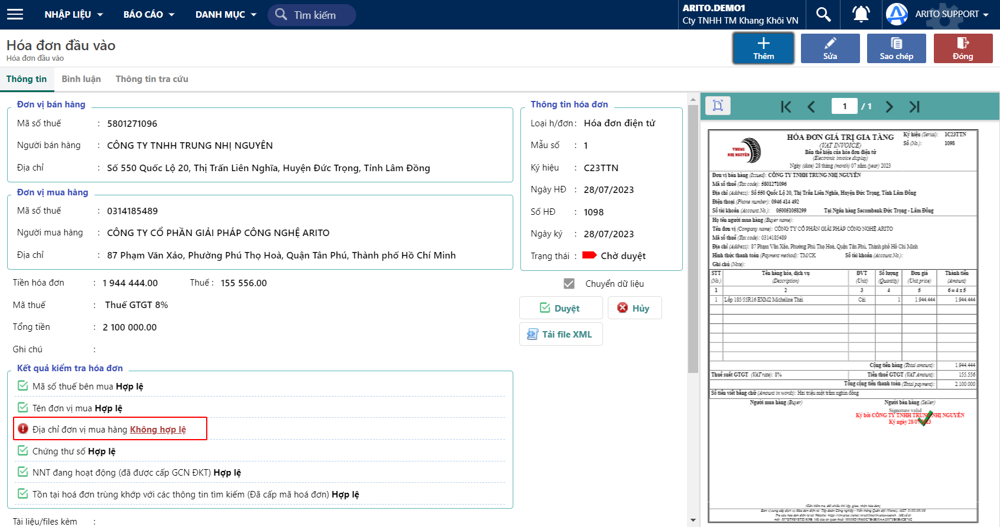
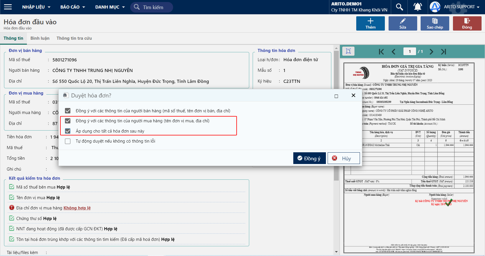

# \[DONE]Duyệt tên đơn vị, địa chỉ để áp dụng cho các hoá đơn sau

### Trường hợp địa chỉ đơn vị mua khác với địa chỉ đăng ký kinh doanh

Khi kiểm tra hoá đơn đầu vào, thì phần mềm sẽ cảnh báo Địa chỉ mua hàng: Không hợp lệ

<figure><figcaption>
Màn hình chứng từ
</figcaption></figure>

Sau khi nhấp vào nút Duyệt, thì hệ thống sẽ tự động bung lên các lựa chọn và bắt buộc chọn 2 nút

* Đồng ý với các thông tin của người mua hàng (tên đơn vị mua, địa chỉ)
* Áp dụng cho tất cả hoá đơn sau này

<figure><figcaption>
Màn hình duyệt
</figcaption></figure>

Nếu duyệt hoá đơn trong trường hợp này thì các hoá đơn sau hệ thống sẽ tự động kiểm tra là hợp lệ đối với địa chỉ đã được duyệt.
