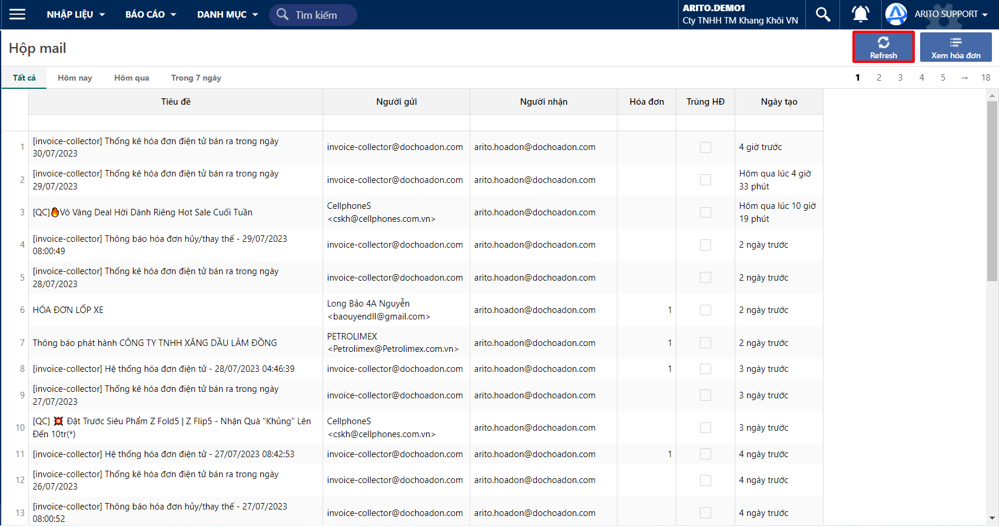
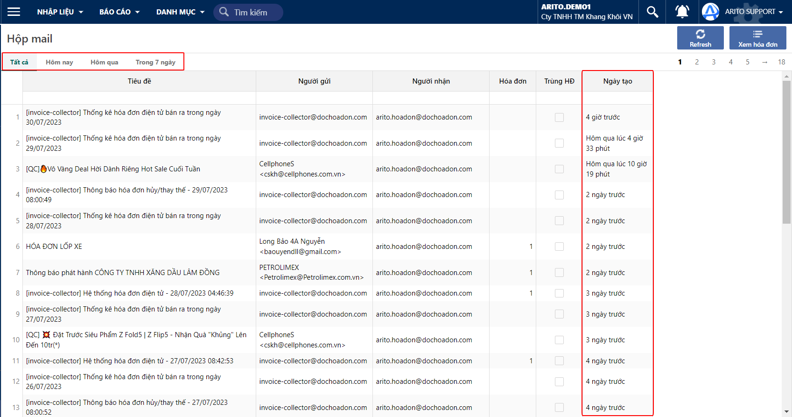
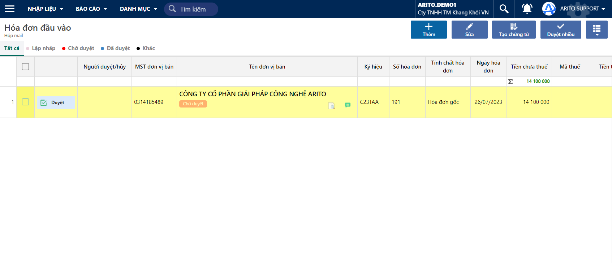
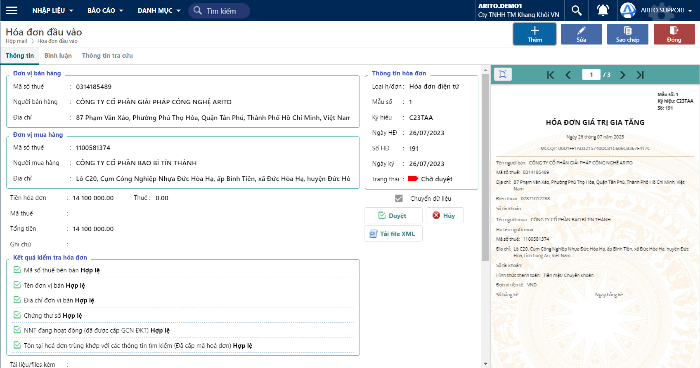
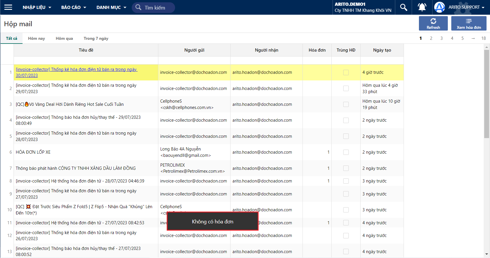

# \[DONE]Hộp thư

## Mục đích

* Dùng để kiểm tra các hoá đơn đã được gửi vào trong các hộp thư
* Xem lịch sử gửi các hoá đơn đầu vào

## Các bước thao tác

Tại ứng dụng Hoá đơn đầu vào, chọn chức năng Hộp thư

#### Xem các hoá đơn được gửi mới nhất

Ấn nút refresh trên hộp mail

<figure><figcaption>
Hộp mail
</figcaption></figure>

#### Xem lịch sử nhận hoá đơn đầu vào của các hộp thư

<figure><figcaption>
Hộp mail
</figcaption></figure>

Khi nhấp vào hộp thư, nếu có hoá đơn đầu vào được gửi về thì sẽ hiển thị danh sách các hoá đơn đầu vào nếu có như sau:

<figure><figcaption>
Hoá đơn đầu vào
</figcaption></figure>

Nhập vào phiếu thì sẽ hiển thị thông tin của hoá đơn dầu vào, tại màn hình này có thể Xem, Duyệt/ Huỷ hoá đơn đầu vào

<figure><figcaption>
Hoá đơn đầu vào
</figcaption></figure>

Nếu khi nhấp vào hộp thư, nếu không có các hoá đơn đầu vào được gửi về thì sẽ hiển thị như sau:

<figure><figcaption>
Hộp thư
</figcaption></figure>
