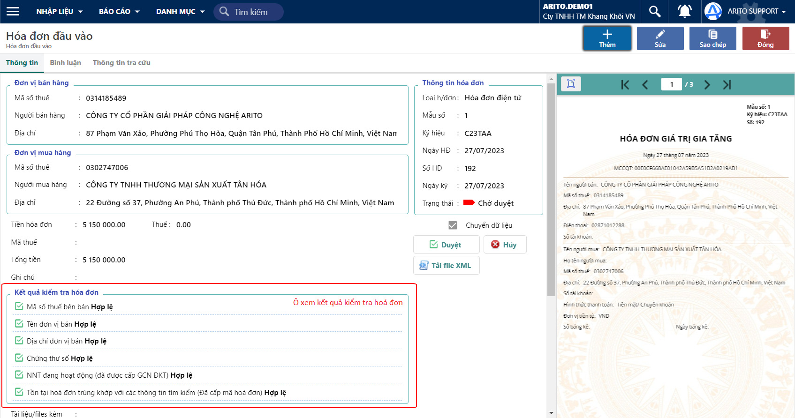

---
layout:
  title:
    visible: true
  description:
    visible: false
  tableOfContents:
    visible: true
  outline:
    visible: true
  pagination:
    visible: false
---

# \[DONE]Kiểm tra tính hợp lệ

**Bước 1:** Ở màn hình Hoá đơn đầu vào, nhấp vào MST đơn vị bán hoặc Tên đơn vị bán để xem hóa đơn

<figure><figcaption>
Hoá đơn đầu vào
</figcaption></figure>

**Bước 2:** Xem kết quả kiểm tra tính hợp lệ của hoá đơn tại ô Kết quả kiểm tra hoá đơn

<figure><figcaption>
Xem kết quả kiểm tra hoá đơn
</figcaption></figure>
